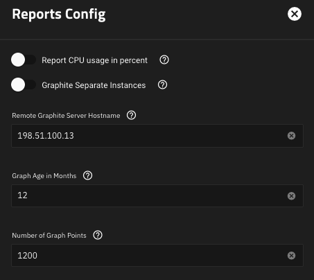
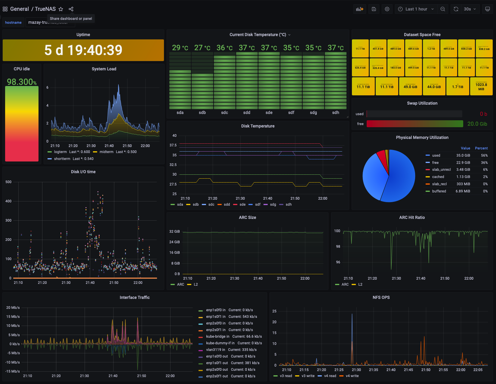

# truenas-grafana

This is just a merge of [the truenas forum post](https://www.truenas.com/community/threads/how-to-expose-data-for-prometheus.98532/post-714809) and [the truenas-influxdb-grafana](https://github.com/cucac/truenas-influxdb-grafana), make sure to appreciate the original authors.

## Prerequisites

- prometheus server with configured service discovery
- grafana instance configured to use the prometheus as datasource

## Implementation

1. clone the repo:
    ```shell
    git clone https://github.com/mazay/truenas-grafana.git && cd truenas-grafana
    ```
1. deploy the `graphite-exporter`, mind the `loadBalancerIP` that's where TrueNAS should push metrics to, multiple instance should be able to use that but you might need to bump the `resources`:
    ```shell
    kubectl apply -f truenas-graphite-exporter.yaml
    ```
1. configure TrueNAS for pushing metrics to the `graphite-exporter` endpoint

1. import the dashboard from `TrueNAS-dashboard.json`
1. profitų


## TODO

- The `graphite-exporter` mappings aren't great and might need some love but they work for me as is.
- Not particularly happy about the `Dataset Space Free` panel but it's minor.
